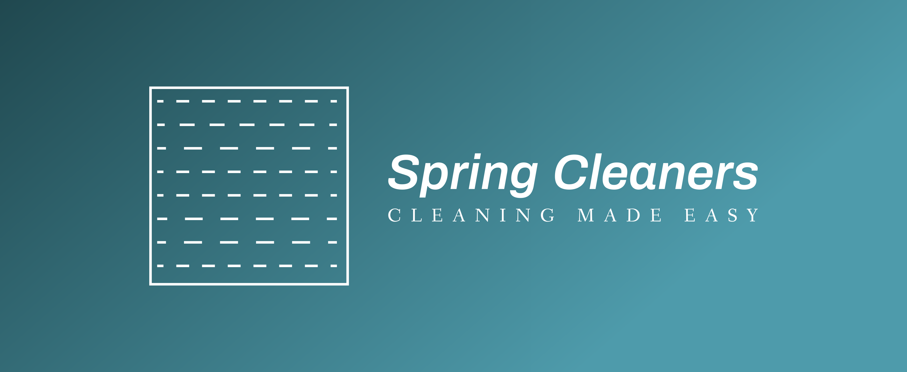

# 

Front and back end Ruby on Rails web app where non-professional cleaners can find customers who are able to setup appointments for somebody to clean their home through the app. `Customers` can create an appointment request, and `Cleaners` can view all unassigned appointments and assign/unassign them to themselves. Features:
- standard, Google, and Facebook authentication
- messaging between `Cleaner` and `Customer`
<!-- - administration privileges to update user data in the application through the client -->

# Getting started

To get the Rails server running locally:

- Clone this repo
- `bundle install` to install all required dependencies
- `rake db:migrate` to make all database migrations
- `rails s` to start the local server

# Code Overview

## Dependencies

- [fomantic-ui-sass](https://github.com/fomantic/Fomantic-UI-SASS) - For front end framework
- [omniauth](https://github.com/mbleigh/acts-as-taggable-on) - For implementing standardized Multi-Provider Authentication
- [omniauth-facebook](https://github.com/mbleigh/acts-as-taggable-on) - Facebook OAuth2 Strategy for OmniAuthAuthentication
- [omniauth-google-oauth2](https://github.com/mbleigh/acts-as-taggable-on) - Google OAuth2 Strategy for OmniAuthAuthentication
- [jquery-rails](https://github.com/plataformatec/devise) - For use of jquery JavaScript library

## Architecture and Models

- `app/models` - Contains the database models for the application where we can define methods, validations, queries, and relations to other models.
  - A `User` has_one `sub_class` of types `Cleaner` and `Customer`.
  - A `Cleaner` and `Customer` has many `Appointments`. A `Cleaner` has many `Customers` through `Appointments` and vice-versa.
  - A `Cleaner` belongs_to an `Institution`, and an `Institution` has_many `Cleaners`.
  - A `User` has_many `Conversations`
  - A `Conversation` has many `Messages`
- `app/views` - Contains templates for user interface.
- `app/controllers` - Contains the controllers where requests are routed to their actions, where we find and manipulate our models and return them for the views to render.
- `config` - Contains configuration files for our Rails application and for our database, along with an `initializers` folder for scripts that get run on boot.
- `db` - Contains the migrations needed to create our database schema.

## Configuration

### Authentication

Standard authentication only requires an email and password upon registration.

If you wish to use OmniAuth for Facebook and Google authentications however, create your own .env file in the root folder and fill in your own google or Facebook credentials.

```
GOOGLE_CLIENT_ID=<your client id here>
GOOGLE_CLIENT_SECRET=<your client here>

FACEBOOK_APP_ID=<your app id here>
FACEBOOK_APP_SECRET=<your app secret here>
```
